# 🗃️ File Compression and Indexing System

[](https://www.python.org/downloads/)
[](LICENSE)
[]()
[]()

> **A sophisticated file compression and indexing system that combines optimal lossless compression with lightning-fast data retrieval using advanced tree structures.**

## 🌟 Features at a Glance

| Feature | Description | Performance |
|---------|-------------|-------------|
| 🔧 **Huffman Compression** | Optimal lossless compression algorithm | 40-60% size reduction |
| 🌳 **Dual Tree Indexing** | B-Tree + Red-Black Tree structures | O(log n) search time |
| 🖥️ **Modern GUI** | Professional PyQt5 interface | Real-time visualization |
| ⚡ **CLI Interface** | Command-line for automation | Batch processing support |
| 📊 **Performance Analytics** | Compression metrics & benchmarks | Built-in profiling tools |
| 🔍 **Visual Trees** | Interactive tree structure display | Educational & debugging |

## 🏗️ System Architecture

```mermaid
graph TB
    A[🖥️ User Interface Layer] --> B[🎯 Application Controller]
    B --> C[📦 Compression Engine]
    B --> D[🗂️ Storage Engine]
    B --> E[🔍 Search Engine]
    
    C --> F[📊 Huffman Algorithm]
    C --> G[📈 Frequency Analyzer]
    C --> H[🌳 Tree Builder]
    
    D --> I[🅱️ B-Tree Index]
    D --> J[🔴 Red-Black Tree]
    D --> K[💾 File Manager]
    
    E --> L[🔍 Unified Search]
    E --> M[📋 Results Handler]
      style A fill:#e1f5fe
    style F fill:#f3e5f5
    style I fill:#e8f5e8
    style J fill:#ffebee
```



## 🏛️ System Architecture Overview

### High-Level Architecture Diagram

```
+------------------------------+
|         CLI Interface        |
+------------------------------+
            |        |
            v        v
+----------------+ +----------------+
| Compression    | | Storage        |
| Module         | | Module         |
+----------------+ +----------------+
| - Huffman Tree | | - B/B+ Tree    |
| - Encoder      | | - Red-Black    |
| - Decoder      | |   Tree         |
| - Analyzer     | | - Index Mgmt   |
+----------------+ +----------------+
            |        |
            v        v
+------------------------------+
|      File System Access      |
+------------------------------+
```

### Detailed Component Flow

```mermaid
graph TB
    CLI[🖥️ CLI Interface] --> CM[📦 Compression Module]
    CLI --> SM[🗂️ Storage Module]
    
    CM --> HT[🌳 Huffman Tree]
    CM --> EN[🔧 Encoder]
    CM --> DE[🔓 Decoder]
    CM --> AN[📊 Analyzer]
    
    SM --> BT[🅱️ B/B+ Tree]
    SM --> RB[🔴 Red-Black Tree]
    SM --> IM[📇 Index Management]
    
    HT --> FS[💾 File System Access]
    EN --> FS
    DE --> FS
    AN --> FS
    BT --> FS
    RB --> FS
    IM --> FS
      style CLI fill:#e1f5fe
    style CM fill:#f3e5f5
    style SM fill:#e8f5e8
    style FS fill:#fff3e0
```



> **📸 Visual Reference**: [View Original Architecture Diagram](https://i.ibb.co/xSPw8Wxn/diagram.png)

## 🚀 Quick Start

### Prerequisites

- Python 3.8 or higher
- PyQt5 for GUI interface

### Installation

1. **Clone the repository**
   ```bash
   git clone https://github.com/Mehmetbaruk/file-compression-indexing-system.git
   cd file-compression-indexing-system
   ```

2. **Install dependencies**
   ```bash
   pip install -r requirements.txt
   ```

3. **Launch the application**
   ```bash
   # GUI Interface (Recommended)
   python gui_launcher.py
   
   # CLI Interface
   python gui_launcher.py --cli
   
   # Direct main module
   python main.py
   ```

## 💡 Core Technologies

### 🔧 Compression Module

**Huffman Coding Implementation**
- **Frequency Analysis**: Dynamic character frequency calculation
- **Tree Construction**: Optimal binary tree generation using priority queues
- **Bit-Level Encoding**: Custom binary representation with padding handling
- **Lossless Guarantee**: Perfect reconstruction of original data


### 🗂️ Storage Module

| Data Structure | Use Case | Time Complexity | Space Complexity |
|----------------|----------|-----------------|------------------|
| **B-Tree** | File indexing, Range queries | O(log n) | O(n) |
| **Red-Black Tree** | Fast searching, In-memory ops | O(log n) | O(n) |
| **Hash Index** | Direct access, Metadata | O(1) average | O(n) |

**B-Tree Features:**
- ✅ Self-balancing with configurable degree
- ✅ Optimal for disk-based operations
- ✅ Range query support
- ✅ Bulk loading capabilities

**Red-Black Tree Features:**
- ✅ Guaranteed O(log n) height
- ✅ Fast insertion and deletion
- ✅ Color-coded visualization
- ✅ Memory-efficient operations
## 🖥️ User Interfaces

### GUI Interface (Recommended)

**Modern PyQt5 Application with Tabbed Interface:**

| Tab | Description | Key Features |
|-----|-------------|--------------|
| 📦 **Compression** | File compression/decompression | Progress tracking, metrics display |
| 🌳 **RB-Tree Storage** | Red-Black tree operations | Interactive tree visualization |
| 🅱️ **B-Tree Storage** | B-tree indexing operations | Node structure display |
| 🔍 **Unified Search** | Cross-tree search capabilities | Performance comparison |
| 📊 **Visualizations** | Tree structure rendering | Real-time algorithm animation |
| ⚡ **Batch Operations** | Multi-file processing | Progress monitoring |
| 📈 **Benchmarks** | Performance testing suite | Detailed metrics analysis |
| 🎮 **Demo** | Interactive system demo | Educational walkthrough |
| ⚙️ **Configuration** | System settings management | User preferences |

### CLI Interface

**Professional command-line interface for automation:**

```bash
# Compression operations
python main.py compress input.txt output.huff
python main.py decompress output.huff restored.txt

# Tree operations
python main.py btree-add filename.txt
python main.py rbtree-search "filename.txt"

# Batch processing
python main.py batch-compress ./documents/ --filter "*.txt"

# Visualization
python main.py visualize-trees --output tree_structure.png
```

## 📊 Performance Metrics

### Compression Performance

| File Type | Average Compression Ratio | Speed (KB/s) | Memory Usage |
|-----------|---------------------------|--------------|--------------|
| **Plain Text** | 45-65% | 1,200-1,800 | Low |
| **Source Code** | 35-55% | 1,000-1,500 | Low |
| **Documentation** | 40-60% | 1,100-1,600 | Low |
| **Configuration** | 50-70% | 1,300-2,000 | Low |

### Search Performance (10,000 files)

| Operation | B-Tree | Red-Black Tree | Linear Search |
|-----------|--------|----------------|---------------|
| **Single Search** | 0.18ms | 0.21ms | 45.2ms |
| **Range Query** | 2.3ms | N/A | 278ms |
| **Bulk Insert** | 12.4ms | 15.7ms | 892ms |
| **Memory Usage** | Moderate | Low | High |

## 🎯 Use Cases

### For Developers


- **Project Archival**: Compress source code projects for storage
- **Build Optimization**: Reduce artifact sizes in CI/CD pipelines
- **Documentation Management**: Organize and compress technical docs

### For Data Scientists
- **Dataset Compression**: Reduce storage costs for large text datasets
- **Algorithm Research**: Study compression and tree algorithm implementations
- **Performance Analysis**: Benchmark data structure performance

### For Educators
- **Algorithm Visualization**: Teach Huffman coding and tree structures
- **Interactive Learning**: Hands-on experience with computer science concepts
- **Research Projects**: Foundation for advanced algorithm implementations

## 🔧 Technical Deep Dive

### Huffman Algorithm Implementation

```mermaid
graph TD
    A[📄 Input Text] --> B[📊 Character Frequency]
    B --> C[🏗️ Priority Queue]
    C --> D[🌳 Build Huffman Tree]
    D --> E[📋 Generate Codes]
    E --> F[💾 Encode Text]
    
    F --> G[📁 Compressed File]
    G --> H[🌳 Extract Tree]
    H --> I[🔍 Decode Bits]
    I --> J[📄 Original Text]
    
    style A fill:#e3f2fd
    style G fill:#e8f5e8
    style J fill:#fff3e0
```



**Key Features:**
- ✅ Optimal prefix-free codes
- ✅ Dynamic frequency analysis
- ✅ Tree serialization/deserialization
- ✅ Bit-level manipulation
- ✅ Memory-efficient encoding

### Tree Data Structures

#### B-Tree Implementation
```python
class BTreeNode:
    def __init__(self, degree):
        self.keys = []          # File metadata
        self.children = []      # Child nodes
        self.is_leaf = True     # Leaf indicator
        self.degree = degree    # Maximum children
```

#### Red-Black Tree Implementation
```python
class RBNode:
    def __init__(self, key, color='RED'):
        self.key = key          # File identifier
        self.color = color      # RED or BLACK
        self.left = None        # Left child
        self.right = None       # Right child
        self.parent = None      # Parent node
```

## 📁 Project Structure

```
file-compression-indexing-system/
├── 📂 cli/                    # Command-line interface
│   ├── interface.py           # Main CLI controller
│   ├── compression_handler.py # Compression commands
│   └── storage_handler.py     # Storage commands
├── 📂 gui/                    # Graphical interface
│   ├── app.py                # Main GUI application
│   ├── other_tabs.py         # Additional GUI tabs
│   └── visualization_tab.py  # Tree visualization
├── 📂 compression/            # Compression algorithms
│   └── huffman.py            # Huffman coding implementation
├── 📂 storage/               # Data structures
│   ├── btree.py              # B-Tree implementation
│   └── red_black_tree.py     # Red-Black Tree implementation
├── 📂 tests/                 # Test suite
│   ├── unit/                 # Unit tests
│   ├── integration/          # Integration tests
│   └── performance/          # Performance tests
├── 📂 utils/                 # Utility modules
│   └── config_manager.py     # Configuration management
├── requirements.txt          # Python dependencies
├── gui_launcher.py          # Application launcher
└── README.md                # Project documentation
```

## 🧪 Testing & Quality Assurance

### Test Coverage

| Module | Unit Tests | Integration Tests | Performance Tests |
|--------|------------|-------------------|-------------------|
| **Compression** | ✅ 95% | ✅ Complete | ✅ Benchmarked |
| **B-Tree** | ✅ 92% | ✅ Complete | ✅ Benchmarked |
| **Red-Black Tree** | ✅ 94% | ✅ Complete | ✅ Benchmarked |
| **GUI Interface** | ✅ 88% | ✅ Partial | ⏳ In Progress |
| **CLI Interface** | ✅ 90% | ✅ Complete | ✅ Benchmarked |

### Running Tests

```bash
# Run all tests
python -m pytest tests/

# Run specific test categories
python -m pytest tests/unit/
python -m pytest tests/integration/
python -m pytest tests/performance/

# Generate coverage report
python -m pytest --cov=. --cov-report=html
```

## 🤝 Contributing

We welcome contributions! Here's how you can help:

1. **🐛 Bug Reports**: Found a bug? Open an issue with detailed reproduction steps
2. **💡 Feature Requests**: Have an idea? We'd love to hear it!
3. **🔧 Code Contributions**: Fork, develop, and submit a pull request
4. **📖 Documentation**: Help improve our documentation
5. **🧪 Testing**: Add test cases for better coverage

### Development Setup

```bash
# Clone and setup development environment
git clone https://github.com/Mehmetbaruk/file-compression-indexing-system.git
cd file-compression-indexing-system

# Install development dependencies
pip install -r requirements.txt
pip install pytest pytest-cov black flake8

# Run pre-commit checks
black .
flake8 .
pytest
```

## 📜 License

This project is licensed under the MIT License - see the [LICENSE](LICENSE) file for details.

## 🙏 Acknowledgments

- **Computer Science Community**: For the foundational algorithms and data structures
- **PyQt5 Team**: For the excellent GUI framework
- **Python Community**: For the amazing ecosystem and tools
- **Academic Institutions**: For advancing computer science education

## 📞 Support & Contact

- 🐛 **Issues**: [GitHub Issues](https://github.com/Mehmetbaruk/file-compression-indexing-system/issues)
- 💬 **Discussions**: [GitHub Discussions](https://github.com/Mehmetbaruk/file-compression-indexing-system/discussions)
- 📧 **Email**: [mehmetbaruk38@gmail.com](mailto:mehmetbaruk38@gmail.com)

---

<div align="center">

### ⭐ If you find this project useful, please consider giving it a star! ⭐

**Made with ❤️ for the Computer Science Community**


</div>


